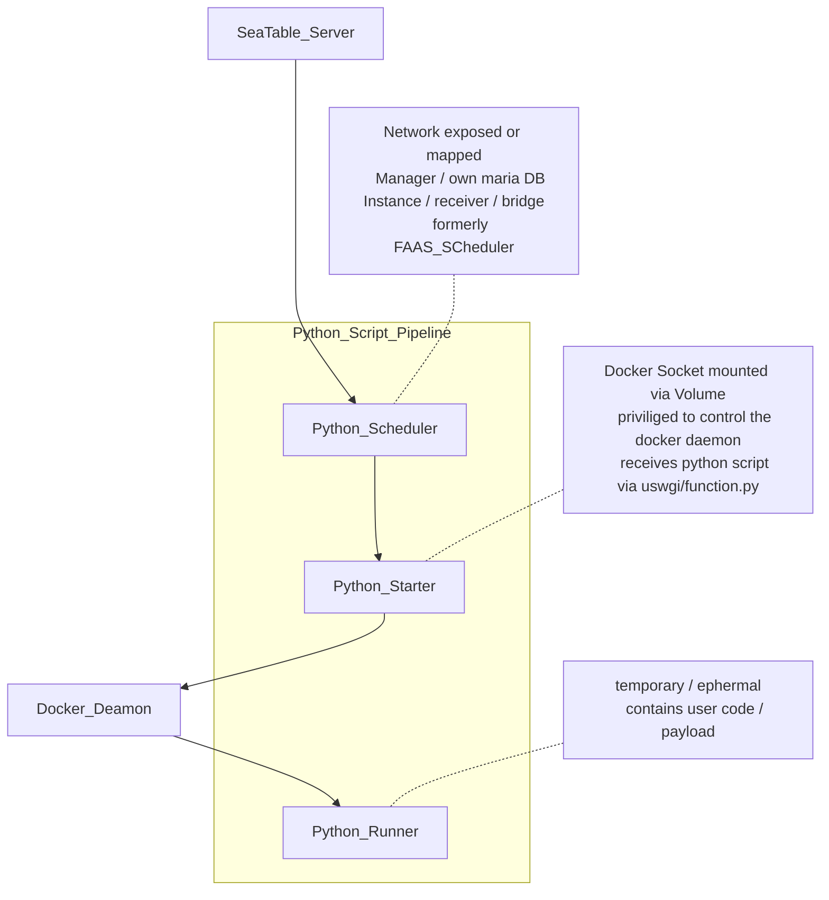

# Seatable Python Pipeline

This repository contains the definition of three container images (Scheduler, Starter, Runner) designed to securely run Python code, retrieve and deliver the output in the context of Seatable. 
These Image are built by Github Actions and pushed to Docker Hub.
During a Seatable Deployment these images are then pulled from Docker Hub by Docker Compose.
These are meant to be used in conjunction with a dcoker-compose.yml. Please refer to admin.seatable.io for more information.

## Todo

- [ ] **escalate:** A separate docker.com user in the seatable organisation is recommended:
 Access Tokens are always user bound / personal accounts should be avoided for this use case
- [ ] **escalate:** set up branch protection (no direct push to main) (!not possible without github team)

- [ ] remove python-starter limitation
  - seatable-python-starter named volume in docker-compose has to be present in the docker host before "docker compose up -d" is called
  - seatable-python-starter container working dir and volume on host has to be identical

- [ ] change phusion base image / outdated? concept with slow releases ->
  If PID is |=1 tini can be used with a standard language specific base image (e.g. gcc, golang, python, .. or debian slim) (https://github.com/krallin/tini#using-tini)

## Scheduler
A Scheduler for forwarding the requests to run scripts, and responsible for statistics the data related to scripts running

## Starter
Python Starter is a uswgi/flask container that provides a api to accept request of running python script, run script in a docker container and post the output of script to scheduler.

## Runner
The Dockerfile of the image for running script is in `./runner`.
Some python site-packages are included in the in image:

- requests
- seatable-api
- dateutils
- pyOpenSSL
- pandas
- Pillow
- python-barcode

Every time we update [seatable-api](https://pypi.org/project/seatable-api/), we update the runner and starter image so that the latest seatable-api version is included.
