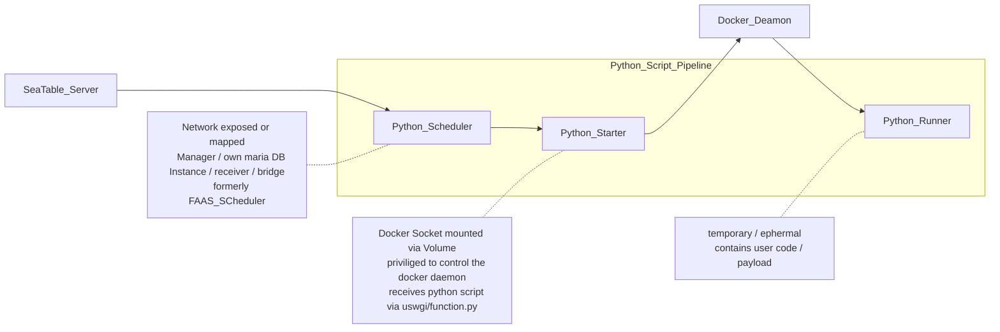

# Seatable Python Pipeline

This repository contains the definition of three container images (Scheduler, Starter, Runner) designed to securely run Python code, retrieve and deliver the output in the context of Seatable. These images are meant to be used in conjunction with a dcoker-compose.yml. Please refer to admin.seatable.io for more information.

## Todo

- [ ] A separate docker.com user in the seatable organisation is recommended:
 Access Tokens are always user bound / personal accounts should be avoided for this use case

- [ ] remove current limitation / seatable-python-starter container working dir and mount on host has to be identical

- [ ] finish and test github action and container image push
  - [x] on push
  - [ ] on base image change
  - [ ] on pypi package change (seatable api)

- [x] activate dockerhub security screening (evaluate dockerscout free for 3 repos in free tier)
  - [ ] evaulate needed actions based on results

- [ ] set up branch protection (no direct push to main)

-- done
- [x] change location of scheduler Dockerfile to top level inside scheduler folder
(Dockerhub Token / set inside repo / github action)
- [x] evaluate connection to dockerhub (separate user ?) and exposure in github secrets manager
(for now the connection uses anconrads personal docker hub account)
- [x] changed repo setting to allow github actions
- [x] versioning, tags, naming (versioning tags from a file? are git tags used ?)
  - [x] short_sha tag debugged, version from file in component subfolder is read as tag
  - [x] currrently every github action run produces images with the latest, the github run number (build_number) and commit sha tags

## Container-Images

These Image are built by Github Actions and pushed to Docker Hub.
In a Seatable Deployment these images are then pulled from Docker Hub by Docker Compose.

## Scheduler
A Scheduler for forwarding the requests to run scripts, and responsible for statistics the data related to scripts running

## Starter
Python Starter is a uswgi/flask container that provides a api to accept request of running python script, run script in a docker container and post the output of script to scheduler.

## Runner
The Dockerfile of the image for running script is in `./runner`.
Some python site-packages are included in the in image:

- requests
- seatable-api
- dateutils
- pyOpenSSL
- pandas
- Pillow
- python-barcode

Every time we update [seatable-api](https://pypi.org/project/seatable-api/), we update the runner and starter image so that the latest seatable-api version is included.
