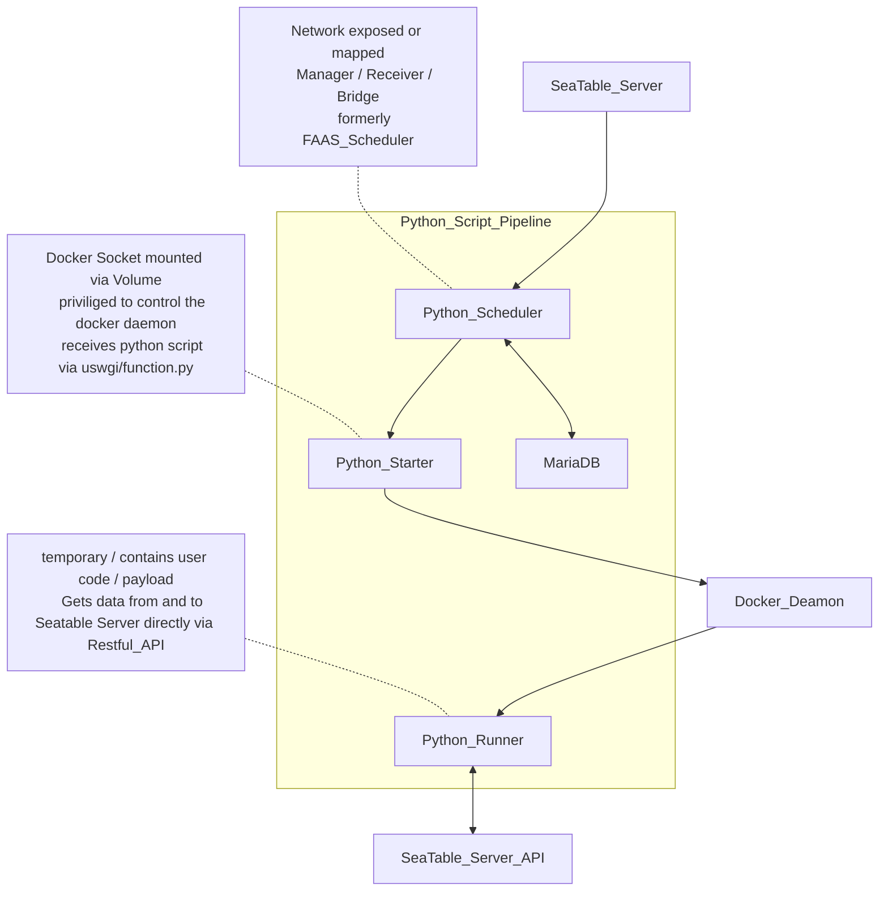

# Seatable Python Pipeline

This repository contains the definition of three container images (Scheduler, Starter, Runner) designed to securely run Python code, retrieve and deliver the output in the context of Seatable.
These Image are built by Github Actions and pushed to Docker Hub.
During a Seatable Deployment these images are then pulled from Docker Hub by Docker Compose.
These are meant to be used in conjunction with docker compose. Please refer to [https://admin.seatable.io](https://admin.seatable.io) for more information.

## Usage
- Clone this repository
- Checkout a new branch
- Make changes to the image definition(s)
- Build the new image localy
- Test localy or push image with a "dev" tag to docker hub
- Commit and push your changes
- Create a pull request

```bash
git clone <this repo>
git ckeckout -b <new branch>
# make changes
cd <image_directory>
docker build -t seatable/<image_name>:dev . # <image_name> options: seatable-python-starter  / seatable-python-runner / seatable-python-scheduler
# optional: docker push seatable/<image_name>:dev
# test your changes
git add . && git commit -m "<commit_message>"
```



## Scheduler
A Scheduler for forwarding the requests to run scripts, and responsible for statistics the data related to scripts running

## Starter
Python Starter is a uswgi/flask container that provides a api to accept request of running python script, starts a runner docker container in which the script is executed in and posts the output of script to the scheduler.

## Runner
Python Runner is a container that runs the python script in a sandboxed environment and posts the output of script to the starter.
Some python site-packages are included in the in image:

- requests
- seatable-api
- dateutils
- pyOpenSSL
- pandas
- Pillow
- python-barcode

Every time we update [seatable-api](https://pypi.org/project/seatable-api/), we update the runner and starter image so that the latest seatable-api version is included.
