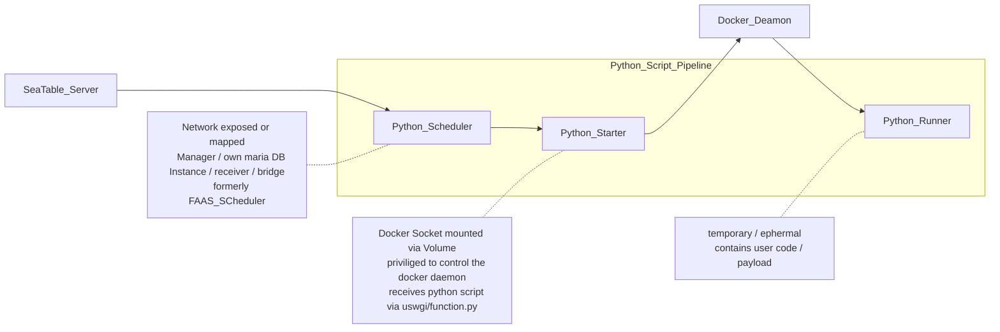

# Seatable Python Pipeline

This repository contains the definition of three container images (Scheduler, Starter, Runner) designed to securely run Python code, retrieve and deliver the output in the context of Seatable.

## Todo

- [ ] finish and test github action and container image push
  - [x] on push
  - [ ] on base image change
  - [ ] on pypi package change (seatable api)

- [ ] A separate docker.com user in the seatable organisation is recommended:
 Access Tokens are always user bound / personal accounts should be avoided for this use case

- [ ] remove current limitation / seatable-python-starter container working dir and mount on host has to be identical
- [ ] change location of scheduler Dockerfile to top level inside scheduler folder
(Dockerhub Token / set inside repo / github action)
- [ ] set up branch protection (no direct push to main)

-- done
- [x] evaluate connection to dockerhub (separate user ?) and exposure in github secrets manager
(for now the connection uses anconrads personal docker hub account)
- [x] changed repo setting to allow github actions

## Container-Images

These Image are built by Github Actions and pushed to Docker Hub.
In a Seatable Deployment these images are then pulled from Docker Hub, triggered by Docker Compose.

## Scheduler
A Scheduler for forwarding the requests to run scripts, and responsible for statistics the data related to scripts running

## Starter
Responsible for running python scripts.

## Runner

Python runner is a flask server that provides a api to accept request of running python script, run script in a docker container and post the output of script to scheduler.

We provide a code package and some docs to help user to deploy python runner. What content in the package, like following:

- ./functions/run-python/function.py
- ./functions/run-python/init.sh
- ./functions/run-python/server_requirements.txt
- ./functions/run-python/settings.py
- ./functions/run-python/start.sh
- ./functions/run-python/stop.sh
- ./functions/run-python/uwsgi.ini
- ./functions/run-python/version

We suggest you to deploy runner server in uwsgi, so you perhaps need to change some sets about uwsgi in uwsgi.ini for yourself.

The Dockerfile of the image for running script is in `./functions/run-python/docker`. We prepare some python site-packages in image like:

- requests
- seatable-api
- dateutils
- pyOpenSSL
- pandas
- Pillow
- python-barcode

Every time we update [seatable-api](https://pypi.org/project/seatable-api/), we update the runner image so that seatable-api version is the latest.
