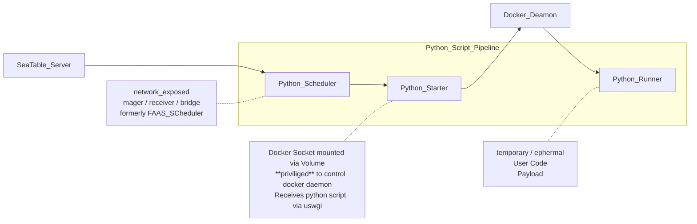

# Seatable Python Pipeline

This repository contains the Definition of three Containers (Scheduler, Starter, Runner) designed to run Python Scripts safely in the context of Seatable.

## Todo

- [ ] finish and test github action and image push
- [ ] fix current limitation / seatable-python-starter container working dir and mount on host has to be the same
- [ ] change location of scheduler Dockerfile to top level inside scheduler folder
(Dockerhub Token / set inside repo / github action)
- [ ] branch protection

## Container-Images

These Image are built by Github Actions and pushed to Docker Hub.
In a Seatable Deployment these images are then pulled from Docker Hub, triggered by Docker Compose.

## Scheduler
A Scheduler for forwarding the requests to run scripts, and responsible for statistics the data related to scripts running

## Starter
Responsible for running python scripts.

## Runner

Python runner is a flask server that provides a api to accept request of running python script, run script in a docker container and post the output of script to scheduler.

We provide a code package and some docs to help user to deploy python runner. What content in the package, like following:

- ./functions/run-python/function.py
- ./functions/run-python/init.sh
- ./functions/run-python/server_requirements.txt
- ./functions/run-python/settings.py
- ./functions/run-python/start.sh
- ./functions/run-python/stop.sh
- ./functions/run-python/uwsgi.ini
- ./functions/run-python/version

We suggest you to deploy runner server in uwsgi, so you perhaps need to change some sets about uwsgi in uwsgi.ini for yourself.

The Dockerfile of the image for running script is in `./functions/run-python/docker`. We prepare some python site-packages in image like:

- requests
- seatable-api
- dateutils
- pyOpenSSL
- pandas
- Pillow
- python-barcode

Every time we update [seatable-api](https://pypi.org/project/seatable-api/), we update the runner image so that seatable-api version is the latest.
